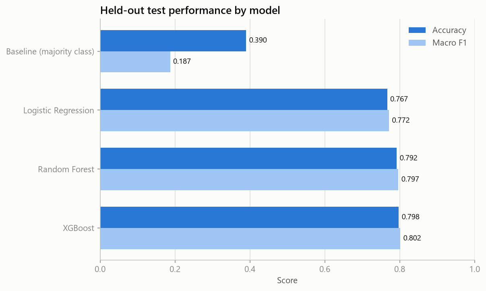
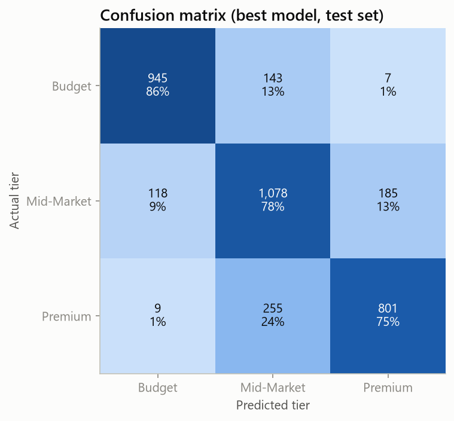
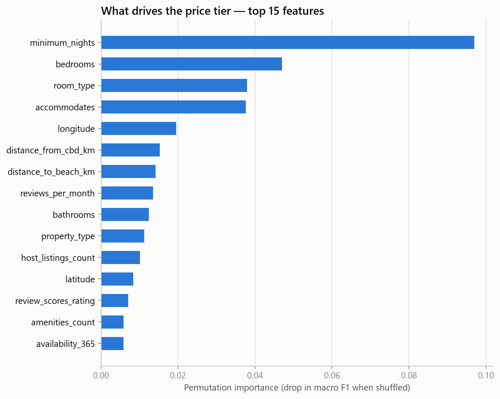
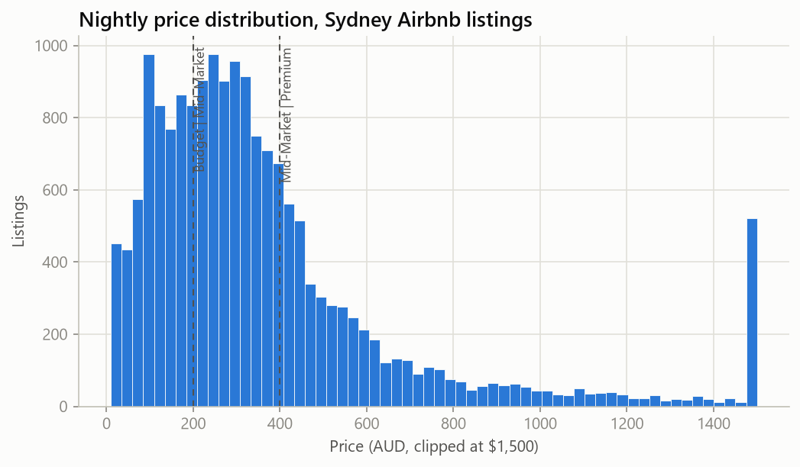
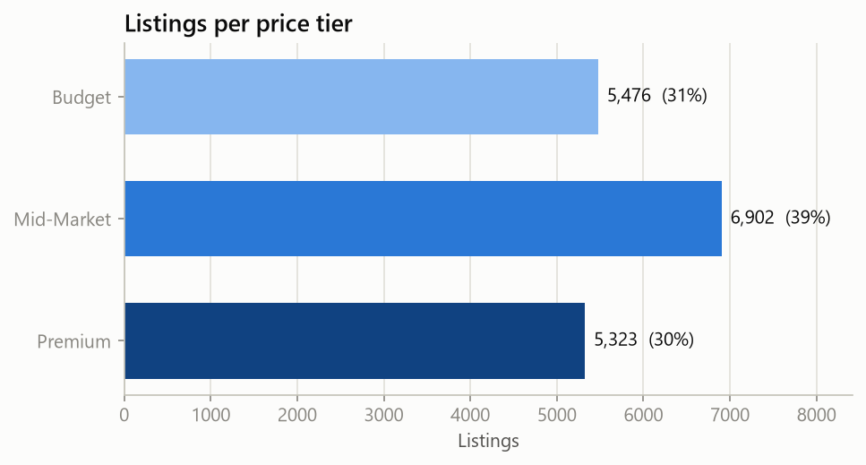
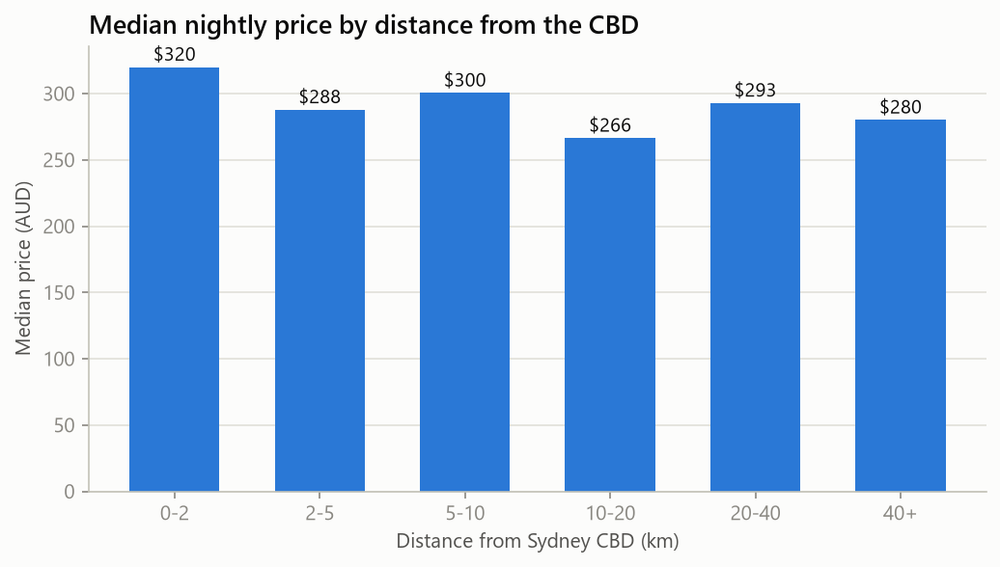
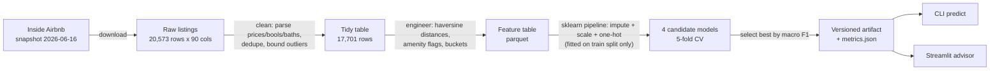

# Sydney Airbnb Price Intelligence

[](https://github.com/adhu-601/sydney-airbnb-price-intelligence/actions/workflows/ci.yml)


**An end-to-end machine-learning product that tells a Sydney Airbnb host which
price tier their property belongs in — and why.**

New hosts routinely misprice: too low and they leave money on the table, too
high and they sit vacant. This project turns the public
[Inside Airbnb](https://insideairbnb.com) dataset (17,701 live Sydney listings,
June 2026 snapshot) into a pricing advisor:

- **`airbnb-pricer` CLI** — one command reproduces the whole pipeline:
  download → clean → engineer features → train → evaluate → report.
- **Streamlit app** — describe a listing, get its recommended tier
  (Budget ≤ $200 / Mid-Market $200–400 / Premium > $400 AUD per night) with
  model confidence, plus a market explorer with listing maps and
  neighbourhood statistics.
- **Python API** — `PricingAdvisor.predict_one(listing_dict)` for programmatic
  use; one serving path shared by the app, CLI, and tests.

## Results

Three-class tier classification, stratified 80/20 split, 5-fold CV on the
training split. The majority-class baseline sets the floor at 39% accuracy.

| Model | Test accuracy | Macro F1 | Macro ROC AUC |
|---|---|---|---|
| Baseline (majority class) | 0.390 | 0.187 | 0.500 |
| Logistic Regression | 0.767 | 0.772 | 0.909 |
| Random Forest | 0.792 | 0.797 | 0.926 |
| **XGBoost** (selected) | **0.798** | **0.802** | **0.930** |



Errors are almost entirely *adjacent-tier*: the model virtually never confuses
Budget with Premium (16 of 3,541 test listings, 0.5%).



What drives the recommendation: stay policy (`minimum_nights`), capacity
(`bedrooms`, `accommodates`, `room_type`) and location (longitude,
distance to CBD, distance to nearest beach).



<details>
<summary>More figures: price distribution, tier balance, price vs distance</summary>





</details>

## Quickstart

```bash
git clone <this-repo> && cd sydney-airbnb-price-intelligence
python -m venv .venv && source .venv/bin/activate   # Windows: .venv\Scripts\activate
pip install -e ".[app,dev]"

airbnb-pricer all            # download -> prepare -> train -> report  (~5 min)
airbnb-pricer predict --demo # price an example listing from the terminal
streamlit run app/streamlit_app.py
```

Every stage also runs standalone (`download`, `prepare`, `train`, `report`,
`predict --listing '<json>'`). All parameters — snapshot date, tier
thresholds, feature settings, model candidates — live in
[`config/config.yaml`](config/config.yaml).

## How it works



**Feature engineering** (24 model features): haversine `distance_from_cbd_km`
and `distance_to_beach_km` (nearest of five major beaches), amenity count and
six high-signal amenity flags (pool, air conditioning, parking, ...), host
scale and superhost status, review volume/quality, capacity buckets, and
rare property types collapsed into "Other".

**Engineering decisions worth reading:**

- **Leakage-safe preprocessing.** Imputation, scaling, and encoding happen
  *inside* the sklearn `Pipeline`, so they are fitted on the training split
  only and travel with the persisted model artifact.
- **Resilient to schema drift.** The 2026-06 snapshot ships three columns
  (`host_response_rate`, `host_acceptance_rate`, `instant_bookable`)
  completely empty. Training detects and drops unobserved features per
  snapshot instead of crashing — and the app hides the corresponding inputs.
- **Market-calibrated targets.** The tier thresholds are round numbers at the
  current market terciles ($200/$400, median $291/night), keeping the classes
  balanced (31/39/30) and the problem honest — against a 69/19/12 split a high
  accuracy would mostly be the baseline.
- **One serving path.** `PricingAdvisor` is the single entry point used by the
  CLI, the app, and the tests, so serving can't drift from training.
- **Auditable artifacts.** The saved model carries its metrics, snapshot date,
  training timestamp, and library versions; `reports/metrics.json` mirrors
  them for review.

## Project structure

```
├── config/config.yaml        # every knob in one reviewable file
├── src/airbnb_pricer/
│   ├── data/                 # download (Inside Airbnb), clean (parse/dedupe/bound)
│   ├── features/             # haversine distances, amenity flags, buckets
│   ├── models/               # train/select, evaluate, serve (PricingAdvisor)
│   ├── viz/                  # shared chart style + report figures
│   └── cli.py                # airbnb-pricer entry point
├── app/streamlit_app.py      # price advisor + market explorer
├── tests/                    # 20 tests incl. an end-to-end training smoke test
│   └── fixtures/             # 800 real listings (0.5 MB) so CI needs no network
├── research/                 # original STAT5003 R analysis (provenance)
└── .github/workflows/ci.yml  # ruff + pytest on Python 3.11–3.13
```

## Testing

```bash
pytest        # 20 tests: parsers, features, training, serving
ruff check src tests app
```

The suite runs the *real* pipeline against a bundled 800-listing sample of the
actual snapshot — including training and a disk round-trip of the model
artifact — so a green build means the pipeline genuinely works, offline.

## Data, scope, and limitations

- **Data:** [Inside Airbnb](https://insideairbnb.com/get-the-data/), Sydney,
  snapshot 2026-06-16, licensed
  [CC BY 4.0](https://creativecommons.org/licenses/by/4.0/). Raw data is not
  committed; `airbnb-pricer download` fetches it reproducibly.
- Listed nightly prices are *asking* prices, not transacted rates.
- The model is a snapshot-in-time of one city; retrain per snapshot (one
  command) rather than reusing stale weights.
- Recommendations are decision support for hosts, not financial advice.

## Provenance

This project grew out of a University of Sydney **STAT5003** group research
project (2025) that compared five classifiers on this problem in R (~77%
accuracy on the 2025 snapshot with $100/$200 tiers). The production rewrite
fixed a distance-computation bug (degrees → kilometres), recalibrated the
tiers to the 2026 market, added XGBoost, tests, CI, and the serving layer.
The original R Markdown analysis is preserved in [`research/`](research/).

## License

[MIT](LICENSE) © 2026 Aditya Moon
