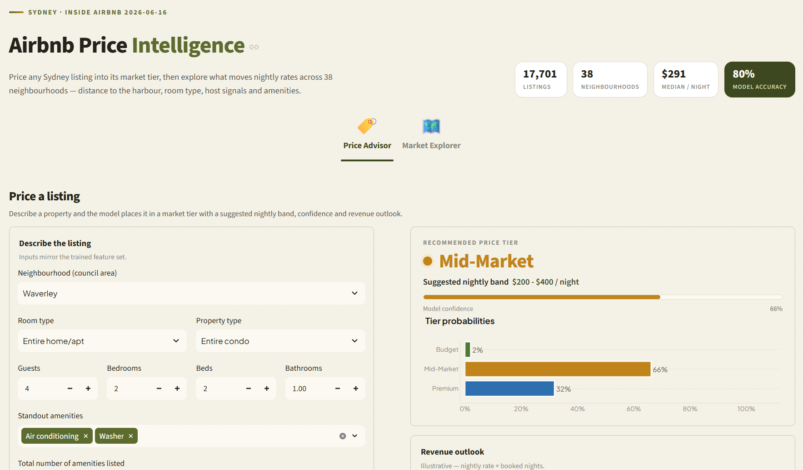
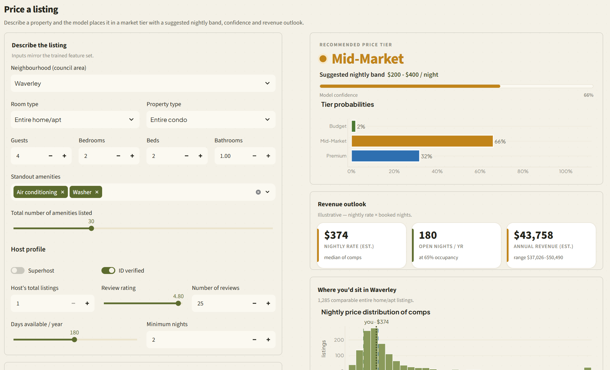
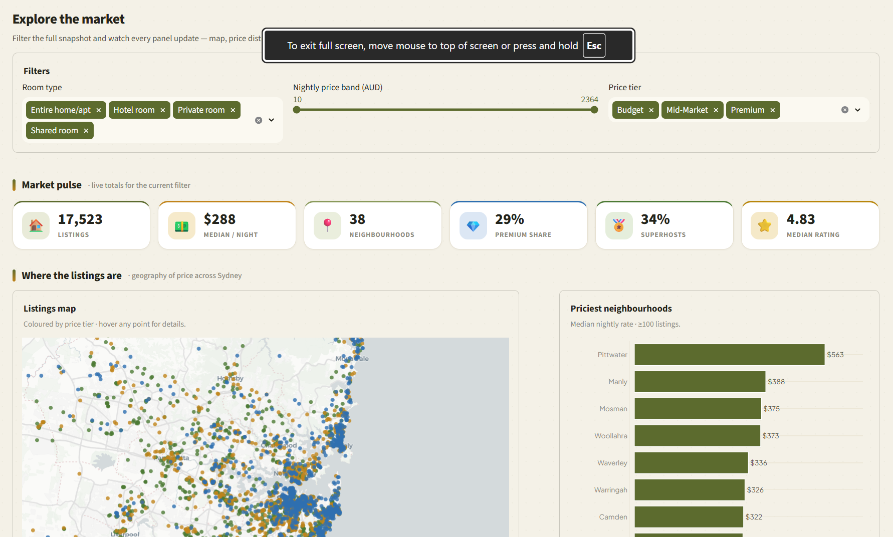
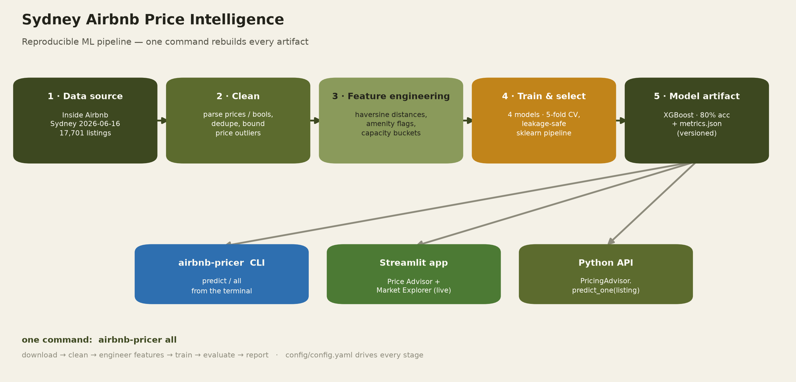
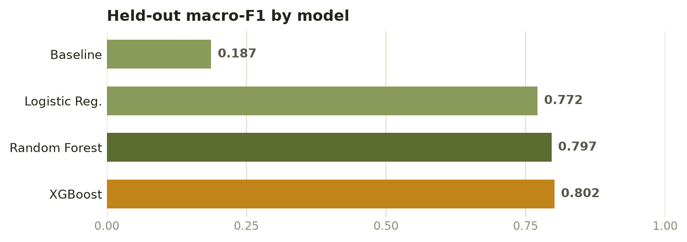

# Sydney Airbnb Price Intelligence

**An end-to-end machine-learning product that tells a Sydney Airbnb host which
price tier their property belongs in — and why.**

> ### 🔗 Live dashboard → **https://sydney-airbnb-price-intelligence.streamlit.app/**

New hosts routinely misprice: too low and they leave money on the table, too
high and they sit vacant. This project turns the public
[Inside Airbnb](https://insideairbnb.com) dataset (17,701 live Sydney listings,
June 2026 snapshot) into a pricing advisor and market dashboard.

---

## The dashboard

Two sections, switched from an Airbnb-style top navigation.

### 💡 Price Advisor

Describe a listing and the XGBoost model places it in a market tier with a
suggested nightly band, model confidence and a revenue outlook, then anchors the
recommendation against comparable listings in the same neighbourhood.

### 🗺️ Market Explorer

A filterable view of the whole snapshot: a live KPI band, a price-tier map with
per-listing hover, the priciest neighbourhoods, price distributions, the
distance-to-CBD price decay, room-type tier mix, amenity premiums and a
per-neighbourhood deep dive.

---

## Architecture

One command (`airbnb-pricer all`) reproduces every artifact — download, clean,
engineer features, train, evaluate and report — with
[`config/config.yaml`](config/config.yaml) driving each stage.

**Feature engineering** (24 model features): haversine `distance_from_cbd_km`
and `distance_to_beach_km` (nearest of five major beaches), amenity count and
six high-signal amenity flags (pool, air conditioning, parking, …), host scale
and superhost status, review volume/quality, capacity buckets, and rare property
types collapsed into “Other”.

**Engineering decisions worth reading:**

- **Leakage-safe preprocessing.** Imputation, scaling and encoding happen
  *inside* the scikit-learn `Pipeline`, so they are fitted on the training split
  only and travel with the persisted model artifact.
- **Resilient to schema drift.** The 2026-06 snapshot ships three columns
  (`host_response_rate`, `host_acceptance_rate`, `instant_bookable`) completely
  empty. Training detects and drops unobserved features per snapshot instead of
  crashing — and the app hides the corresponding inputs.
- **Market-calibrated targets.** Tier thresholds are round numbers at the current
  market terciles ($200 / $400, median $291 / night), keeping the classes
  balanced (31 / 39 / 30) so a high accuracy is genuine rather than the baseline.
- **One serving path.** `PricingAdvisor` is the single entry point used by the
  CLI, the app and the tests, so serving cannot drift from training.
- **Auditable artifacts.** The saved model carries its metrics, snapshot date,
  training timestamp and library versions; `reports/metrics.json` mirrors them.

---

## Model performance

Three-class tier classification, stratified 80/20 split, 5-fold cross-validation
on the training split. The majority-class baseline sets the floor at 39 %
accuracy; XGBoost was selected on macro-F1.

| Model | Test accuracy | Macro F1 | Macro ROC AUC |
|---|---|---|---|
| Baseline (majority class) | 0.390 | 0.187 | 0.500 |
| Logistic Regression | 0.767 | 0.772 | 0.909 |
| Random Forest | 0.792 | 0.797 | 0.926 |
| **XGBoost** (selected) | **0.798** | **0.802** | **0.930** |

Errors are almost entirely *adjacent-tier*: the model virtually never confuses
Budget with Premium (16 of 3,541 test listings, 0.5 %).

---

## 📄 Technical report

A full write-up — data, methodology, feature engineering, results, tables,
figures and references in **APA 7th** format — is available as a rendered
**[PDF](report/sydney_airbnb_price_intelligence.pdf)** /
**[HTML](report/sydney_airbnb_price_intelligence.html)**, generated from the
R Markdown source
**[`report/sydney_airbnb_price_intelligence.Rmd`](report/sydney_airbnb_price_intelligence.Rmd)**.

---

## Data, scope and limitations

- **Data:** [Inside Airbnb](https://insideairbnb.com/get-the-data/), Sydney,
  snapshot 2026-06-16, licensed
  [CC BY 4.0](https://creativecommons.org/licenses/by/4.0/). Raw data is not
  committed; `airbnb-pricer download` fetches it reproducibly.
- Listed nightly prices are *asking* prices, not transacted rates.
- The model is a snapshot-in-time of one city; retrain per snapshot (one
  command) rather than reusing stale weights.
- Recommendations are decision support for hosts, not financial advice.

## License

[MIT](LICENSE) © 2026 Aditya Moon
